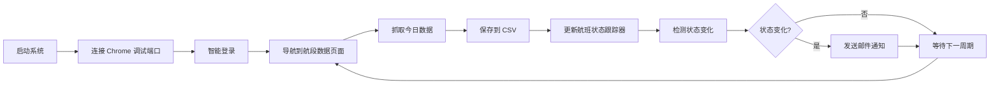
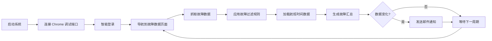

# 航段数据监控系统

<div align="center">

**自动化航班状态监控与故障跟踪系统**

[](https://www.python.org/)
[](https://drissionpage.cn/)
[]()

</div>

---

## 项目简介

航段数据监控系统是一个基于 **DrissionPage** 框架的自动化航班状态监控解决方案，专为越捷航空（VietJet）的 C909 飞机运营监控设计。系统支持实时监控航段状态变化（起飞、降落、备降等异常），并通过 Gmail 发送邮件通知。

### 核心功能

- **🛫 航段数据监控** - 实时跟踪航班起降状态（OUT/OFF/ON/IN）
- **⚠️ 故障数据监控** - 智能过滤并推送飞机故障信息
- **📧 Gmail 邮件通知** - 状态变化和异常事件自动告警
- **🧠 智能导航系统** - 自动检测页面状态并跳转
- **📊 航班状态跟踪** - 多飞机多航班状态实时追踪
- **🔍 故障过滤** - 基于规则的智能故障过滤系统

---

## 项目结构

```
Flight_Status_Monitor/
├── bin/                         # 可执行脚本目录
│   ├── run_leg_scheduler.py     # 航段监控启动器
│   ├── run_fault_scheduler.py   # 故障监控启动器
│   ├── leg_monitor.bat          # 航段监控批处理（端口9222）
│   └── faults_monitor.bat       # 故障监控批处理（端口9333）
│
├── config/                      # 配置目录
│   ├── config.ini               # 核心配置文件
│   ├── config_loader.py         # 配置加载器
│   ├── aircraft_cfg.py          # 飞机号映射配置
│   ├── flight_schedule.py       # 航班计划配置
│   ├── fault_filter_rules.csv   # 故障过滤规则
│   └── fault_group_filter_rules.csv  # 关联故障过滤规则
│
├── core/                        # 核心系统模块
│   ├── browser_handler.py       # 浏览器管理（ChromiumPage）
│   ├── navigator.py             # 智能导航系统
│   ├── logger.py                # 日志记录系统
│   ├── flight_tracker.py        # 航班状态跟踪器
│   ├── abnormal_detector.py     # 异常检测器（备降检测）
│   ├── fault_filter.py          # 故障过滤器
│   ├── base_monitor.py          # 监控器基类
│   └── base_notifier.py         # 通知器基类
│
├── fetchers/                    # 数据抓取器
│   ├── base_fetcher.py          # 抓取器基类
│   ├── login_manager.py         # 登录管理
│   ├── leg_fetcher.py           # 航段数据抓取
│   ├── fault_fetcher.py         # 故障数据抓取
│   ├── fault_parser.py          # 故障数据解析
│   └── fault_data_saver.py      # 故障数据保存
│
├── processors/                  # 数据处理器
│   ├── leg_data_update.py       # 数据更新处理
│   ├── leg_status_monitor.py    # 航段状态监控
│   └── fault_status_monitor.py  # 故障状态监控
│
├── notifiers/                   # 通知模块
│   ├── leg_status_notifier.py   # 航段状态通知器
│   ├── fault_status_notifier.py # 故障状态通知器
│   └── task_notifier.py         # 任务通知器（统一入口）
│
├── schedulers/                  # 调度器
│   ├── base_scheduler.py        # 调度器基类
│   ├── leg_scheduler.py         # 航段数据调度器（端口9222）
│   └── fault_scheduler.py       # 故障数据调度器（端口9333）
│
├── interfaces/                  # 接口定义
│   └── interfaces.py            # 核心接口定义
│
├── data/                        # 数据存储目录
│   ├── daily_raw/               # 每日原始数据
│   ├── backup/                  # 历史备份
│   └── leg_data.csv             # 航段数据汇总
│
├── logs/                        # 系统日志（保留24小时）
├── docs/                        # 项目文档
│   ├── SCHEDULER_GUIDE.md       # 调度模式使用指南
│   └── TIMEZONE.md              # 时区策略说明
│
├── requirements.txt             # 项目依赖
└── README.md                    # 项目说明
```

---

## 技术架构

### 核心技术栈

| 技术 | 版本 | 用途 |
|------|------|------|
| **Python** | 3.8+ | 核心开发语言 |
| **DrissionPage** | 4.0+ | 浏览器自动化框架 |
| **Pandas** | 2.0+ | 数据处理与分析 |

### 架构设计

```
┌─────────────────────────────────────────────────────────┐
│                    调度层 (Schedulers)                   │
│  ┌──────────────────┐        ┌──────────────────┐      │
│  │  LegScheduler    │        │ FaultScheduler   │      │
│  │  (航段监控)       │        │  (故障监控)       │      │
│  └────────┬─────────┘        └────────┬─────────┘      │
└───────────┼──────────────────────────┼─────────────────┘
            │                          │
┌───────────┼──────────────────────────┼─────────────────┐
│           │          抓取层 (Fetchers)│                  │
│  ┌────────▼─────────┐        ┌───────▼──────────┐     │
│  │   LegFetcher     │        │  FaultFetcher    │     │
│  │  (航段数据抓取)    │        │  (故障数据抓取)    │     │
│  └──────────────────┘        └──────────────────┘     │
└─────────────────────────────────────────────────────────┘
            │                          │
┌───────────┼──────────────────────────┼─────────────────┐
│           │        处理层 (Processors)│                  │
│  ┌────────▼─────────┐        ┌───────▼──────────┐     │
│  │LegStatusMonitor  │        │FaultStatusMonitor│     │
│  │(航段状态监控)     │        │(故障状态监控)      │     │
│  └────────┬─────────┘        └────────┬─────────┘     │
└───────────┼──────────────────────────┼─────────────────┘
            │                          │
┌───────────┼──────────────────────────┼─────────────────┐
│           │         通知层 (Notifiers)│                  │
│  ┌────────▼─────────┐        ┌───────▼──────────┐     │
│  │LegStatusNotifier │        │FaultStatusNotifier│    │
│  │(航段状态通知)     │        │(故障状态通知)      │     │
│  └──────────────────┘        └──────────────────┘     │
└─────────────────────────────────────────────────────────┘
            │                          │
┌───────────┼──────────────────────────┼─────────────────┐
│           │         核心层 (Core)     │                  │
│  ┌────────▼─────────┐  ┌─────────────▼──┐  ┌─────────┐ │
│  │ FlightTracker    │  │  FaultFilter    │  │ Navigator│ │
│  │(航班状态跟踪)     │  │  (故障过滤)      │  │(智能导航)│ │
│  └──────────────────┘  └────────────────┘  └─────────┘ │
└─────────────────────────────────────────────────────────┘
```

### 设计模式

- **分层架构** - Fetchers/Processors/Notifiers 职责分离
- **接口隔离** - 定义清晰的模块接口（IFetcher, ILogger, IConfigLoader）
- **依赖注入** - 支持测试和可扩展性
- **单一职责** - 每个模块专注于特定功能
- **策略模式** - 可插拔的通知器和过滤器

---

## 快速开始

### 1. 环境准备

**系统要求：**
- Python 3.8 或更高版本
- Windows 操作系统（支持 Chrome 浏览器）

**安装依赖：**

```bash
# 使用 pip 安装
pip install -r requirements.txt

# 或使用国内镜像加速
pip install -r requirements.txt -i https://pypi.tuna.tsinghua.edu.cn/simple
```

### 2. 配置系统

复制配置模板并填写信息：

```bash
cp config.ini.example config/config.ini
```

编辑 `config/config.ini` 文件：

```ini
[credentials]
username = your_username          # 系统登录账号
password = your_password          # 登录密码

[paths]
user_data_path = D:\path\to\chrome_debug  # Chrome用户数据目录

[aircraft]
aircraft_list = B-652G, B-656E   # 监控的飞机号列表

[scheduler]
start_time = 06:30               # 系统启动时间
end_time = 21:00                 # 系统停止时间

[gmail]
sender_email = your_email@gmail.com
app_password = your_app_password  # Gmail应用专用密码
recipients = recipient@example.com
sender_name = 越捷航段监控系统
```

### 3. 启动 Chrome 调试模式

**方法一：命令行启动**

```bash
chrome.exe --remote-debugging-port=9222 --user-data-dir="D:\Code\Flight_Status_Monitor\chrome_debug"
```

**方法二：创建快捷方式**

1. 右键桌面 → 新建快捷方式
2. 目标设置为：
   ```
   "C:\Program Files\Google\Chrome\Application\chrome.exe" --remote-debugging-port=9222 --user-data-dir="D:\Code\Flight_Status_Monitor\chrome_debug"
   ```

### 4. 运行系统

**方式一：双击批处理脚本（推荐）**

- `bin/leg_monitor.bat` - 启动航段监控（端口 9222）
- `bin/faults_monitor.bat` - 启动故障监控（端口 9333）

**方式二：命令行运行**

```bash
# 航段监控
python bin/run_leg_scheduler.py

# 故障监控
python bin/run_fault_scheduler.py
```

**方式三：模块方式运行**

```bash
# 航段监控
python -m schedulers.leg_scheduler

# 故障监控
python -m schedulers.fault_scheduler
```

---

## 功能特性

### ✅ 航段数据监控

- **实时状态跟踪** - 监控 OUT/OFF/ON/IN 四个关键时间点
- **起飞检测** - 自动检测飞机起飞事件
- **降落检测** - 自动检测飞机降落事件
- **备降检测** - 识别异常备降情况
- **多飞机支持** - 同时监控多架飞机的多个航班

### ✅ 故障数据监控

- **智能故障过滤** - 基于配置规则过滤无关故障
- **组合规则** - 支持多字段 AND 关系的过滤规则
- **关联故障规则** - 支持同一时间多故障组合过滤
- **故障汇总** - 按飞机、航班自动分组汇总
- **时间背景** - 计算故障相对航班时间点的时间差

### ✅ 邮件通知系统

- **航段状态通知** - 起飞、降落事件自动通知
- **故障通知** - 过滤后的故障信息推送
- **状态变化检测** - 基于哈希的去重机制
- **HTML 格式** - 美观的邮件模板
- **时区转换** - 自动转换为越南时间显示

### ✅ 智能导航系统

- **自动登录** - 检测登录状态并自动登录
- **页面跳转** - 智能识别并跳转到目标模块
- **超时处理** - 自动处理登录超时情况
- **多标签管理** - 支持多标签页协同工作

### ✅ 航班状态跟踪

- **状态追踪** - 实时跟踪每架飞机的航班状态
- **阶段判断** - 自动判断当前所处阶段（计划中/滑出/空中/落地/滑入）
- **优先级决策** - 智能决策优先监控哪个页面
- **到达监控** - 自动触发到达监控（等待落地/滑入）

---

## 配置说明

### 调度时间配置

在 `config.ini` 的 `[scheduler]` 部分配置：

```ini
[scheduler]
start_time = 06:30    # 系统启动时间（24小时制）
end_time = 21:00      # 系统停止时间
```

### Gmail 通知配置

1. 启用 Gmail 两步验证
2. 生成应用专用密码：https://myaccount.google.com/apppasswords
3. 在 `config.ini` 中配置：

```ini
[gmail]
sender_email = your_email@gmail.com
app_password = your_app_password  # 应用专用密码（非账号密码）
recipients = recipient1@example.com, recipient2@example.com
sender_name = 越捷航段监控系统
```

### 故障过滤规则配置

**组合过滤规则** (`config/fault_filter_rules.csv`)：

```csv
机号,故障类型,飞行阶段,描述
B-652G,一般故障,地面,测试故障
```

- 同一行多个条件为 AND 关系
- 多行规则之间为 OR 关系
- 支持模糊匹配

**关联故障过滤规则** (`config/fault_group_filter_rules.csv`)：

```csv
故障描述1,故障描述2,故障描述3
故障描述A,故障描述B,
```

- 当同一时间出现所有配置的故障时，全部过滤
- 至少需要 2 个故障描述

### 时区配置

**项目统一使用北京时间 (UTC+8)**

- **内部时间**：北京时间
- **邮件展示**：越南时间（北京时间 -1 小时）

详见：[docs/TIMEZONE.md](docs/TIMEZONE.md)

---

## 工作流程

### 航段监控流程



### 故障监控流程



---

## 常见问题

### Q1: 浏览器连接失败？

**A:** 确保 Chrome 已以调试模式启动，且端口为 9222。

检查步骤：
1. 打开任务管理器，确认 Chrome 进程存在
2. 检查启动命令中端口号是否正确
3. 确认防火墙未阻止该端口

### Q2: 登录失败？

**A:** 检查 `config.ini` 中的用户名和密码是否正确。

可能原因：
- 用户名或密码错误
- 网络连接问题
- 系统维护中

### Q3: Gmail 邮件发送失败？

**A:** 确保已启用两步验证并生成应用专用密码。

注意事项：
- 不要使用账号密码，必须使用应用专用密码
- 检查网络连接
- 确认发件人邮箱未启用限制性安全设置

### Q4: 如何查看系统日志？

**A:** 日志文件存储在 `logs/` 目录下，按日期命名（`YYYY-MM-DD.log`）。

日志保留 24 小时，自动清理过期日志。

### Q5: 调度时间如何配置？

**A:** 在 `config.ini` 的 `[scheduler]` 部分配置 `start_time` 和 `end_time`。

系统会在 `start_time` 自动启动，在 `end_time` 自动停止。

### Q6: 如何添加新的监控飞机？

**A:** 在 `config.ini` 的 `[aircraft]` 部分修改 `aircraft_list`：

```ini
aircraft_list = B-652G, B-656E, B-XXX
```

---

## 开发指南

### 添加新的数据抓取模块

1. 在 `fetchers/` 目录创建新的 fetcher 类
2. 继承 `BaseFetcher` 基类
3. 实现必要的抓取方法
4. 在对应的 scheduler 中调用

示例：

```python
from fetchers.base_fetcher import BaseFetcher

class MyFetcher(BaseFetcher):
    def __init__(self):
        super().__init__()

    def fetch_data(self, page, target_date):
        # 实现抓取逻辑
        pass
```

### 添加新的数据处理流程

1. 在 `processors/` 目录创建新的 processor
2. 实现数据处理逻辑
3. 在对应的 scheduler 中调用

### 扩展通知方式

在 `notifiers/` 目录添加新的通知器类（如微信、钉钉等），继承 `BaseNotifier` 基类。

---

## 版本历史

- **V4.3.0** (2025-01-14)
  - 添加故障过滤功能
  - 优化故障邮件显示格式和排序逻辑
  - 重构项目架构，优化模块化和代码复用

- **V4.2.0** (2025-01-13)
  - 添加故障数据监控功能
  - 实现智能故障过滤系统
  - 优化邮件通知格式

- **V4.1.0** (2025-01-12)
  - 重构为双调度器架构（Leg + Fault）
  - 添加依赖注入支持
  - 优化模块化设计

- **V4.0.0** (2025-01-11)
  - 全面重构为分层架构
  - 采用 fetchers/processors 分离设计
  - 添加接口定义和依赖注入

- **V3.0.0** (2026-01-11)
  - 专注于航段状态变化监控
  - 优化系统架构和模块化

---

## 许可证

本项目仅供内部使用。

---

## 联系方式

如有问题，请联系系统管理员。
