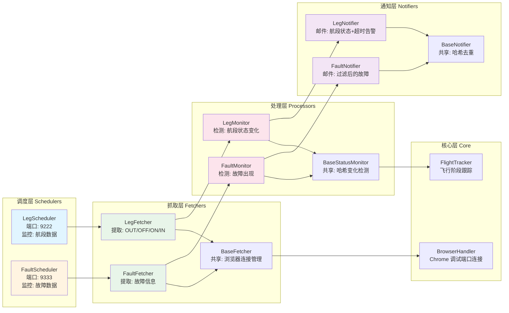

# Flight Status Monitor

<div align="center">

**自动化航班状态监控与故障跟踪系统**

[](https://www.python.org/)
[](https://drissionpage.cn/)
[]()

</div>

---

## 📖 项目简介

Flight Status Monitor 是一个基于 DrissionPage 框架的自动化航班状态监控解决方案，专为越捷航空（VietJet）C909 飞机运营监控设计。

### 核心功能

- **🛫 航段数据监控** - 实时跟踪 OUT/OFF/ON/IN 四个关键时间点
- **⏱️ 航段告警系统** - 基于飞行时长的异常告警（起飞超时、落地超时）
- **⚠️ 故障数据监控** - 智能过滤并推送飞机故障信息
- **📧 Gmail 邮件通知** - 状态变化和异常事件自动告警
- **🧠 智能导航系统** - 自动检测页面状态并跳转
- **🔄 双调度器架构** - 航段和故障独立并行监控

---

## 🚀 快速开始

### 1️⃣ 环境准备

**系统要求：**
- Python 3.8+
- Windows + Chrome 浏览器

**安装依赖：**

```bash
# 创建虚拟环境
python -m venv venv

# 激活虚拟环境
venv\Scripts\activate

# 安装依赖
pip install -r requirements.txt
```

### 2️⃣ 配置系统

```bash
# 复制环境变量模板
cp .env.template .env

# 编辑 .env 文件，填写真实配置
```

**必需配置项：**

```bash
# 系统登录凭证
SYSTEM_USERNAME=your_username
SYSTEM_PASSWORD=your_password

# Gmail 邮件通知（需生成应用专用密码）
GMAIL_SENDER_EMAIL=your_email@gmail.com
GMAIL_APP_PASSWORD=your_app_password
GMAIL_RECIPIENTS=recipient@example.com

# 监控的飞机号列表
AIRCRAFT_LIST=B-XXXX,B-XXXX
```

📖 **详细配置指南**: [docs/guides/security-setup.md](docs/guides/security-setup.md)

### 3️⃣ 启动 Chrome 调试模式

**方法一：命令行启动**

```bash
# 航段监控（端口 9222）
chrome.exe --remote-debugging-port=9222 --user-data-dir="D:\chrome_debug_9222"

# 故障监控（端口 9333）
chrome.exe --remote-debugging-port=9333 --user-data-dir="D:\chrome_debug_9333"
```

**方法二：创建快捷方式**

右键桌面 → 新建快捷方式，目标设置为：
```
"C:\Program Files\Google\Chrome\Application\chrome.exe" --remote-debugging-port=9222 --user-data-dir="D:\chrome_debug_9222"
```

### 4️⃣ 运行系统

**推荐方式：双击批处理脚本**

- `bin/leg_monitor.bat` - 启动航段监控（端口 9222）
- `bin/faults_monitor.bat` - 启动故障监控（端口 9333）

**命令行方式：**

```bash
# 使用便捷脚本（推荐）
vp bin/run_leg_scheduler.py      # 航段监控
vp bin/run_fault_scheduler.py    # 故障监控

# 或直接使用虚拟环境 Python
venv\Scripts\python.exe bin/run_leg_scheduler.py
venv\Scripts\python.exe bin/run_fault_scheduler.py
```

---

## 📁 项目结构

```
Flight_Status_Monitor/
├── bin/              # 生产运行脚本（系统入口）
│   ├── run_leg_scheduler.py
│   ├── run_fault_scheduler.py
│   ├── leg_monitor.bat
│   └── faults_monitor.bat
│
├── config/           # 配置模块
├── core/             # 核心系统（浏览器、日志、监控基类）
├── fetchers/         # 数据抓取器
├── processors/       # 数据处理器
├── notifiers/        # 邮件通知器
├── schedulers/       # 调度器（双调度器架构）
├── interfaces/       # 接口定义
├── exceptions/       # 异常类体系
├── data/             # 数据存储目录
├── logs/             # 系统日志（保留24小时）
├── tests/            # 测试代码
└── docs/             # 项目文档
```

**快速查看模块文档：**

```bash
# 查看核心模块组件
python -c "import core; help(core)"

# 查看数据抓取器
python -c "import fetchers; help(fetchers)"

# 查看调度器
python -c "import schedulers; help(schedulers)"
```

---

## 🏗️ 技术架构

### 系统架构图



### 双调度器设计

**设计模式：**
- 分层架构 - Fetchers/Processors/Notifiers 职责分离
- 接口隔离 - IFetcher, ILogger, IConfigLoader
- 依赖注入 - 支持测试和可扩展性
- 模板方法 - BaseMonitor, BaseScheduler

📖 **详细架构说明**: [docs/architecture/project-structure.md](docs/architecture/project-structure.md)

---

## 🧰 开发指南

### 代码质量工具

```bash
# 使用便捷脚本（推荐）
vp -m ruff check .              # 运行 linter
vp -m ruff check . --fix        # 自动修复
vp -m ruff format .             # 格式化代码

# 或直接使用虚拟环境
venv\Scripts\ruff.exe check .
```

### 运行测试

```bash
vp -m pytest tests/
vp -m pytest tests/test_fault_filter.py -v
```

### 扩展新功能

**添加新的数据抓取模块：**
1. 在 `fetchers/` 创建新类，继承 `BaseFetcher`
2. 在 `schedulers/` 创建对应的调度器，继承 `BaseScheduler`
3. 在 `processors/` 创建数据处理器，继承 `BaseMonitor`
4. 在 `notifiers/` 创建通知器，继承 `BaseNotifier`

详细示例：[docs/guides/dependency-injection.md](docs/guides/dependency-injection.md)

---

## ⚙️ 配置说明

### 关键配置文件

| 文件 | 用途 | 说明 |
|------|------|------|
| `.env` | 敏感配置 | 登录凭证、Gmail 密码（不提交到 Git） |
| `.env.template` | 配置模板 | 环境变量参考示例 |
| `config/fault_filter_rules.csv` | 故障过滤 | 多字段 AND 关系规则 |
| `config/fault_group_filter_rules.csv` | 关联故障过滤 | 同时出现的多故障组合 |

### 时区策略

**项目统一使用北京时间 (UTC+8)**
- 内部时间：北京时间
- 邮件展示：越南时间（北京时间 -1 小时）

📖 **详细说明**: [docs/guides/timezone.md](docs/guides/timezone.md)

---

## 📚 文档导航

### 📖 使用指南（如何做）
- [时区策略](docs/guides/timezone.md) - 时间处理和转换规则
- [安全配置](docs/guides/security-setup.md) - .env 文件设置和 Gmail 配置
- [依赖注入](docs/guides/dependency-injection.md) - 测试和可扩展性

### 🏗️ 架构文档（为什么）
- [项目结构](docs/architecture/project-structure.md) - 目录结构和职责划分
- [错误处理架构](docs/architecture/error-handling.md) - 异常类体系和使用

### 🔧 代码内文档
- `help(core)` - 核心组件（浏览器、日志、监控基类）
- `help(fetchers)` - 数据抓取器（航段、故障数据提取）
- `help(processors)` - 数据处理器（状态监控、告警）
- `help(schedulers)` - 调度器（双调度器架构和生命周期）
- `help(notifiers)` - 通知器（邮件通知和哈希去重）
- `help(config)` - 配置管理（环境变量优先级）
- `help(interfaces)` - 接口契约（依赖注入）
- `help(exceptions)` - 异常类体系（结构化异常处理）

### 📦 历史文档
- [归档报告](docs/archive/) - 历史分析和改进记录（按月份归档）

---

## ❓ 常见问题

### Q: 浏览器连接失败？

**A:** 确保 Chrome 已以调试模式启动，且端口为 9222 或 9333。

检查步骤：
1. 打开任务管理器，确认 Chrome 进程存在
2. 检查启动命令中端口号是否正确
3. 确认防火墙未阻止该端口

### Q: Gmail 邮件发送失败？

**A:** 确保已启用两步验证并生成应用专用密码。

- 不要使用账号密码，必须使用应用专用密码
- 生成地址：https://myaccount.google.com/apppasswords
- 检查网络连接

### Q: 为什么使用虚拟环境？

**A:** 虚拟环境隔离项目依赖，避免与系统 Python 环境冲突。

- 依赖版本固定，不会因系统更新而变化
- 不同项目可以使用不同版本的依赖
- 避免全局安装依赖造成污染

**⚠️ 重要**：项目所有 Python 命令都需要使用虚拟环境：
```bash
venv\Scripts\python.exe bin/run_leg_scheduler.py  # ✅ 正确
python bin/run_leg_scheduler.py                    # ❌ 错误（使用系统 Python）
```

### Q: 笔记本合上后会误报飞机超时吗？

**A:** 不会。系统具有智能数据新鲜度检查功能。

- 检查告警前，先验证数据是否是最新的（5分钟内更新）
- 如果数据过期（如笔记本合上导致浏览器断开），跳过超时告警
- 只在数据是最新的情况下，才发送超时告警

这样可以区分：
- **真实超时**：数据新鲜，飞机确实未落地 → 发送告警 ✓
- **连接失败**：数据过期，浏览器断开 → 不发送误报 ✓

### Q: 如何添加新的监控飞机？

**A:** 在 `.env` 文件中修改 `AIRCRAFT_LIST`：

```bash
AIRCRAFT_LIST=B-XXXX,B-XXXX
```

---

## 📋 版本历史

- **BETA4.6.4** (2026-01-31)
  - 统一文档版本号管理，与 git tag 保持一致
  - 完善所有模块 docstring，确保与实际组件一致
  - 修复文档中的错误引用（移除不存在的 navigator.py）
  - 更新所有文档版本号为 BETA4.6.4
  - 添加 DataFreshnessError 异常导出
  - 修复安全配置文档中的命令示例（使用虚拟环境路径）

- **V4.5.0** (2026-01-30)
  - 添加数据新鲜度检查功能，防止因连接断开导致的误报
  - 添加虚拟环境支持和便捷脚本（`vp.bat`）
  - 完善模块级文档，所有模块支持 `help()` 查看

- **V4.4.2** (2026-01-18)
  - 移除未使用的变量，更新文档

- **V4.4.0** (2026-01-14)
  - 添加航段告警系统（起飞超时、落地超时）
  - 添加 Ruff linter 和 pre-commit hooks

- **V4.3.0** (2026-01-14)
  - 添加故障过滤功能，优化邮件显示格式

- **V4.2.0** (2026-01-13)
  - 添加故障数据监控功能

- **V4.1.0** (2026-01-12)
  - 重构为双调度器架构，添加依赖注入支持

- **V4.0.0** (2026-01-11)
  - 全面重构为分层架构

---

## 📄 许可证

本项目仅供内部使用。

---

## 📧 联系方式

如有问题，请联系系统管理员。
